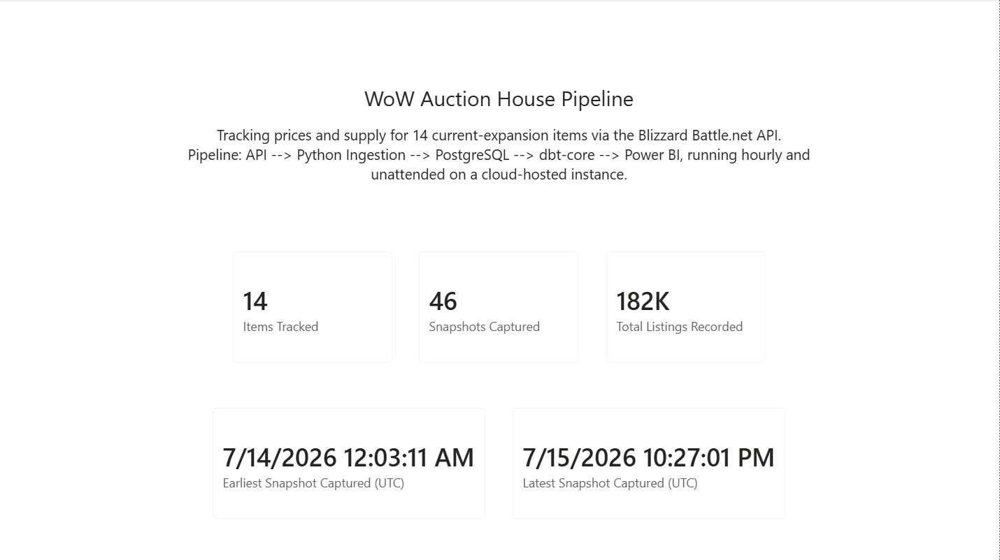
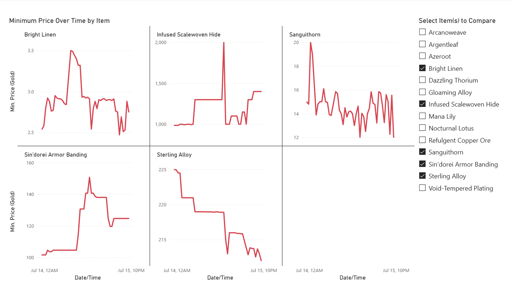
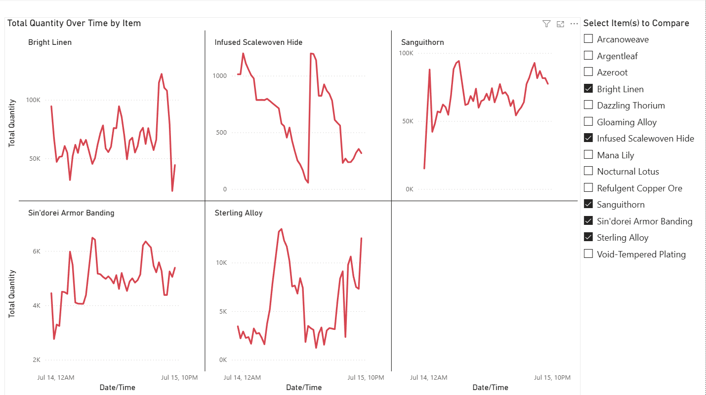
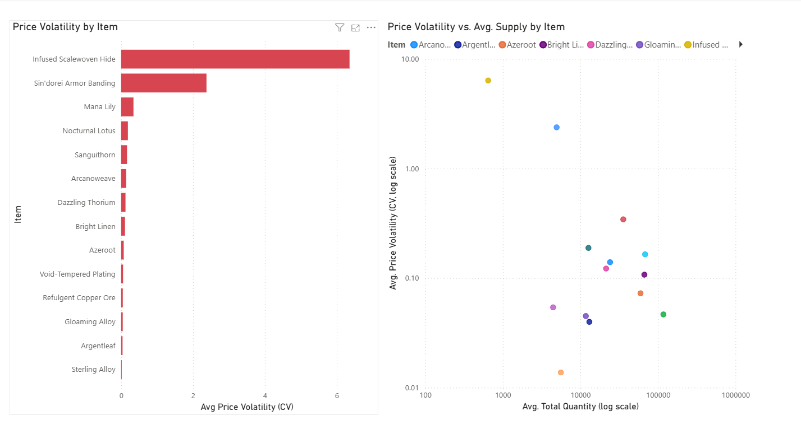
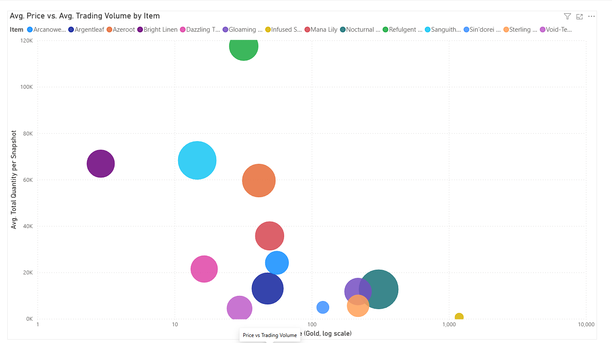

# WoW Auction House Market Dashboard

A data pipeline that tracks World of Warcraft (Midnight expansion) Auction House prices over time. Built to show real ETL and analytics work: API ingestion, data modeling, data quality debugging, cloud deployment, and BI visualization.



## Architecture

```
Blizzard Battle.net API (OAuth)
        │
Python ingestion (ingest.py)
        │
PostgreSQL raw layer
        │
dbt-core: staging → marts
        │
Power BI Desktop
```

Runs hourly on an always-on Oracle Cloud instance, scheduled with cron.

## Dashboard

5 pages: Intro/KPIs, Price Trends, Supply Trends, Volatility, Price vs. Volume.

| | |
|---|---|
|  |  |
|  |  |

Strongest finding: Mana Lily's price spikes track directly with hour-over-hour drops in supply, visible by comparing the Price Trends and Supply Trends pages.

## A few decisions worth calling out

- **Data is keyed at the listing level**, not the item level. Blizzard's API returns one row per auction, not per item, and the schema reflects that.
- **Outlier filtering uses IQR, tuned after a real bug.** A 0.01-gold "penny listing" slipped past the first version of the filter, which only checked the upper bound. Full writeup below.
- **Migrated from Windows Task Scheduler to Oracle Cloud + cron** after two outages caused by the host machine being powered off. Pre-migration data is excluded from the analysis rather than backfilled, since it never existed.
- **Quality tiers (Silver/Gold) aren't exposed by Blizzard's API.** Resolved by comparing prices at the same moment against known in-game prices, since Gold always prices higher.

For the full breakdown of technical decisions, bugs, and the item basket, see [`docs/DEEP_DIVE.md`](docs/DEEP_DIVE.md).

## Tech stack

Python, PostgreSQL, dbt-core, Power BI Desktop, Oracle Cloud Infrastructure, cron, Blizzard Battle.net API

## Repo structure

```
wow-ah-pipeline/
├── wow_ah_dbt/     dbt project: staging + mart models, seeds, tests
├── dashboard/      Power BI .pbix file
├── screenshots/    Dashboard page screenshots
├── scripts/        One-off investigation scripts
├── logs/           Ingestion logs
└── config/         Non-secret configuration
```

## Limitations

- SSL is off on the Postgres connection, offset by IP allowlisting and iptables rules. Fine for a solo project, not for production.
- Timezone conversion uses a fixed UTC offset, not DST-aware.
- Instance is 1 OCPU / 1GB RAM, sized for a 14-item hourly job, not built to scale.

## Next steps

- Automate tier resolution with a scheduled price-comparison script instead of doing it by hand, which could open the door to including Silver-tier items in the basket too. One wrinkle: some item IDs from past expansions are no longer valid in-game but still exist in the API and game files, so a query against them returns an error instead of just no data. Any automated version would need to handle that case rather than assume every ID is live.
- Add automated data quality checks and monitoring
- DST-aware timezone handling
